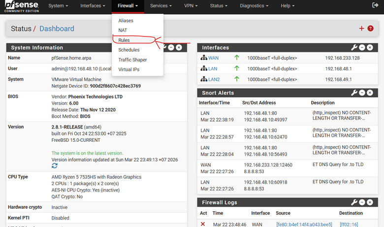

# 📘 Lab 02 – Cấu hình cơ bản pfSense (Firewall Rule)

## 1. Mục đích
- Cho phép truy cập Web UI của pfSense từ mạng WAN
- Hiểu cách hoạt động của Firewall Rule

---

## 2. Mô tả
Mặc định pfSense **không cho phép truy cập từ WAN vào Web UI**.

Lab này tạo rule để:
- Cho phép truy cập từ WAN
- Sử dụng HTTPS

---

## 3. Các bước thực hiện

### Bước 1: Truy cập Firewall Rules
- Firewall → Rules

### Bước 2: Thêm rule
- Nhấn **Add**

### Bước 3: Cấu hình

- Action: Pass
- Interface: WAN
- Protocol: TCP
- Source: Any (hoặc có thể điền IP, Subnet của mạng)
- Destination: WAN Address
- Destination port range: HTTPS
- Description: Cho phép truy cập Web UI từ WAN

---

## 4. Áp dụng
- Save
- Apply Changes

---

## 5. Kiểm tra
- Truy cập: https://<WAN_IP>

---

## 6. Lưu ý
⚠️ Không nên để Source = Any trong môi trường thực tế  
👉 Nên giới hạn IP

---

## 7. Kết quả
- Truy cập được Web UI từ WAN
- Rule hoạt động đúng

---

## 8. Hình ảnh

---
