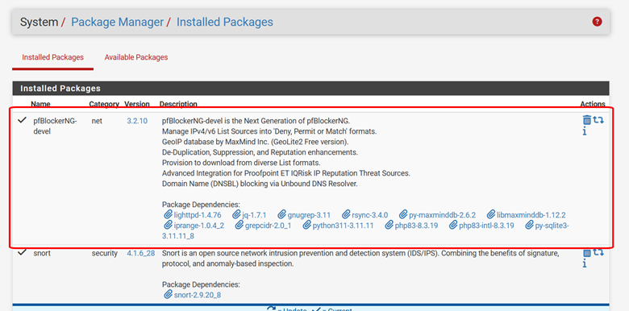
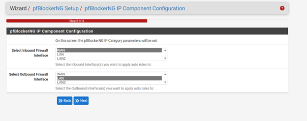
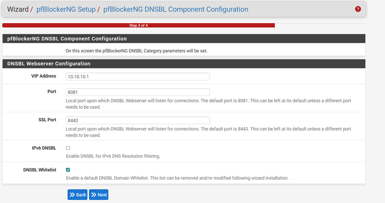
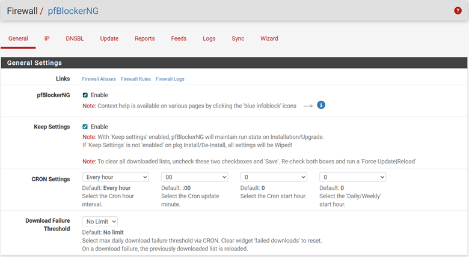
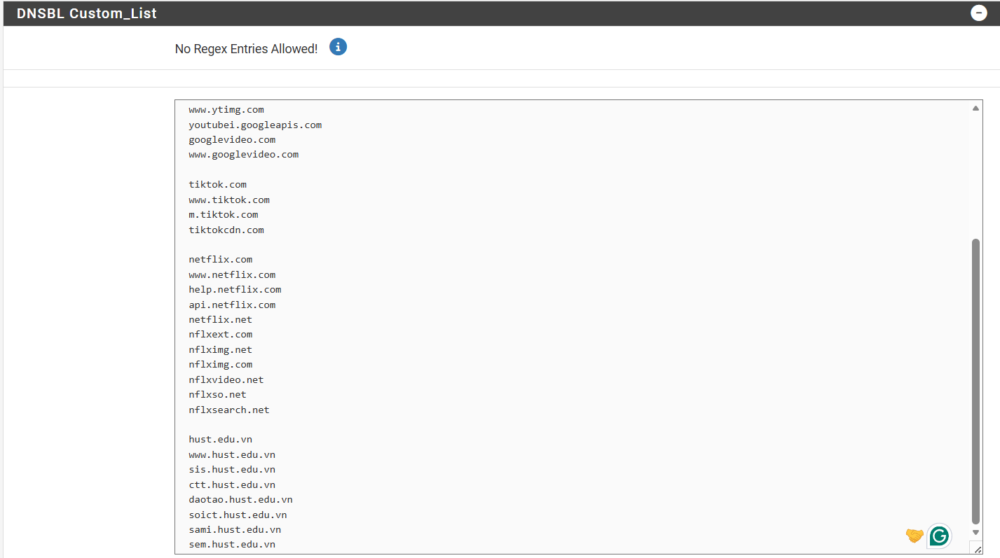

# 🚫 Lab:06 Chặn Website bằng pfBlockerNG trên pfSense

<p align="center">
  
  
  
  
</p>

---

## 📌 Giới thiệu

Bài lab này thực hiện cấu hình **chặn truy cập website trong mạng LAN** bằng **pfBlockerNG (DNSBL)** trên **pfSense**.  
Giải pháp sử dụng cơ chế **DNS Sinkhole** để chuyển hướng domain bị chặn về địa chỉ nội bộ, từ đó ngăn người dùng truy cập.

---

## 🎯 Mục tiêu

Chặn các website trên dải IP: **192.168.48.0** làm ảnh hưởng đến khả năng ngủ 😊 gồm: Phở bò, diu túp, tóp tóp, netflix (end chill ) – Có ny đâu mà thức đêm làm màu 

Và đặc biệt là chặn web của trường Bách Khoa

<em><sub>Đừng vào Hust!</sub></em>


> [!TIP]
> **Không lan man nữa, vào việc!** 😎

---

## 📚 Mục lục

- [📌 Giới thiệu](#-giới-thiệu)
- [🎯 Mục tiêu](#-mục-tiêu)
- [🧠 Nguyên lý hoạt động](#-nguyên-lý-hoạt-động)
- [🛠️ Các bước thực hiện](#️-các-bước-thực-hiện)
  - [1️⃣ Cài đặt package](#1️⃣-cài-đặt-package)
  - [2️⃣ Setup ban đầu](#2️⃣-setup-ban-đầu)
  - [3️⃣ Các tab quan trọng trong pfBlockerNG](#3️⃣-các-tab-quan-trọng-trong-pfblockerng)
  - [4️⃣ Tạo DNSBL Group](#4️⃣-tạo-dnsbl-group)
  - [5️⃣ Cấu hình DNSBL](#5️⃣-cấu-hình-dnsbl)
  - [6️⃣ Thêm danh sách domain chặn](#6️⃣-thêm-danh-sách-domain-chặn)
  - [7️⃣ Update và áp dụng rule](#7️⃣-update-và-áp-dụng-rule)
- [🧪 Kiểm tra kết quả](#-kiểm-tra-kết-quả)
- [📈 Xem Reports và Logs](#-xem-reports-và-logs)
- [⚠️ Lỗi thường gặp](#️-lỗi-thường-gặp)
- [🚀 Kết luận](#-kết-luận)
- [📂 Cấu trúc thư mục](#-cấu-trúc-thư-mục)
- [📌 Cách push lên GitHub](#-cách-push-lên-github)

---

# 🧠 Nguyên lý hoạt động

**pfBlockerNG DNSBL** hoạt động theo cơ chế:

1. Người dùng trong mạng LAN gửi truy vấn DNS tới pfSense
2. pfSense kiểm tra domain có nằm trong danh sách chặn hay không
3. Nếu domain bị block:
   - pfSense sẽ trả về **địa chỉ nội bộ (VIP Address)** thay vì IP thật của website
4. Trình duyệt không thể truy cập được website đó

> [!NOTE]
> Đây là phương pháp **DNS Sinkhole**, thường dùng để:
> - chặn web giải trí
> - chặn quảng cáo
> - chặn domain độc hại
> - kiểm soát truy cập trong doanh nghiệp

---

# 🛠️ Các bước thực hiện

---

## 1️⃣ Cài đặt package

Vào:

```bash
System > Package Manager
```

Tải package:

```bash
pfBlockerNG-devel
```

📷 **Ảnh:**





> [!IMPORTANT]
> Hãy đảm bảo pfSense của bạn **đã có Internet** trước khi cài package.

---

## 2️⃣ Setup ban đầu

Sau khi tải xong, chúng ta sẽ lần lượt setup.

📷 **Ảnh:**







---

## 3️⃣ Các tab quan trọng trong pfBlockerNG

Sau khi setup xong, sẽ có vài thông tin quan trọng cần để ý.




Ở **pfBlockerNG** này sẽ có vài mục cơ bản như sau:

### ⚙️ General
Tab cấu hình tổng thể của **pfBlockerNG**, đây là nơi **bật/tắt toàn bộ pfBlockerNG**

### 🌐 IP
Dùng để **chặn theo IP / subnet / GeoIP**

### 🚫 DNSBL
Dùng để **chặn web dựa theo domain**

### 🔄 Update
Tab **“nạp lại / cập nhật rule”**

### 📊 Reports
Như tên, dùng để **thống kê và xem logs**

### 📥 Feeds
Tab quản lý **nguồn dữ liệu block list**

### 🔁 Sync
Đồng bộ cấu hình **pfBlockerNG**


---

## 4️⃣ Tạo DNSBL Group

Gòi! Giới thiệu tổng quan rồi.  
Giờ sẽ đến lượt **thực hành bài lab**.  
Bài lab này sẽ thực hiện **block web dựa trên domain**.

Vào:

```bash
Firewall > pfBlockerNG > DNSBL > DNSBL Groups > Add
```

---

## 5️⃣ Cấu hình DNSBL

Chọn như sau:

- **VIP Address:** `10.10.10.1` → giữ nguyên  
- **Port:** `8081` → giữ nguyên  
- **SSL Port:** `8443` → giữ nguyên  
---

## 6️⃣ Thêm danh sách domain chặn

List danh sách mọi người sẽ tự thêm nhé!

<em><sub>Đừng vào Hust!</sub></em>





> [!TIP]
> Bạn có thể thêm các domain khác như:
> - youtube.com  (đã thêm)
> - tiktok.com
> - netflix.com
> - facebook.com  (đã thêm)
> tuỳ mục đích quản trị.

---

## 7️⃣ Update và áp dụng rule

Sau khi lưu xong sẽ vào update để chạy.

Vào:

```bash
Firewall > pfBlockerNG > Update > Run
```

📷 **Ảnh:**


> [!WARNING]
> Nếu **không bấm Run / Update**, danh sách chặn sẽ **chưa được áp dụng**.

---

# 🧪 Kiểm tra kết quả

## 🔓 Trước khi chạy pfBlockerNG

📷 **Ảnh:**


---

## 🔒 Kết quả sau khi chặn

**web đã bị chặn hoàn toàn** và không còn có cửa truy cập được nữa giống như mấy thg quý bửu BK đi tán gái hà hà 

**Đừng học Hust!**

📷 **Ảnh:**


---

# 📈 Xem Reports và Logs

Sau khi chặn ta có thể vào **Reports** để xem logs và chỉ số khác.

Vào:

```bash
Firewall > pfBlockerNG > Reports
```

📷 **Ảnh:**


Tại đây có thể xem:

- Domain nào bị truy cập
- Domain nào bị block
- Máy nào trong LAN đang gửi truy vấn DNS
- Thống kê hoạt động của pfBlockerNG

---

# ⚠️ Lỗi thường gặp

## ❌ Đã cấu hình nhưng vẫn vào được website

### Nguyên nhân có thể:
- Chưa bấm **Update > Run**
- Máy client **không dùng DNS của pfSense**
- Trình duyệt đang cache DNS
- Thiết bị đang dùng **DoH / Secure DNS**

### Cách xử lý:
- Chạy lại:
  ```bash
  ipconfig /flushdns
  ```
- Kiểm tra DNS máy client có trỏ về pfSense hay không
- Tắt **Secure DNS** trên trình duyệt
- Chạy lại **Update > Run**

---

## ❌ Không thấy log trong Reports

### Nguyên nhân:
- DNS request không đi qua pfSense
- pfBlockerNG chưa hoạt động đúng

### Cách xử lý:
- Kiểm tra DHCP đã cấp DNS về pfSense chưa
- Kiểm tra dịch vụ DNS Resolver / DNS Forwarder

---


Sau bài lab này có thể nâng cấp thêm các thứ như:

- Chặn theo **dải IP**
- Chặn theo **vùng mạng**
- Chỉ cho phép các **phần mềm cần thiết trong doanh nghiệp**
- Kết hợp **Firewall Rules** để kiểm soát mạnh hơn
- Đảm bảo **tính bảo mật trong mạng LAN**


<p align="center">
  <em>By OtusLettia và chút</em> ☕ + 😵 + <em>một chút mất ngủ vì nhớ em</em>
</p>

---


<p align="center">
   <em><sub>Bài lab này mang tính thực hành và học tập --- ghét BK + quý bửu Hust</sub></em>
</p>
<p align="center">
  <em><sub>Đừng vào Hust!</sub></em>
</p>


---
