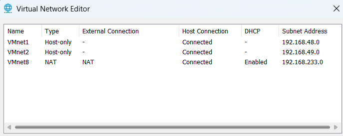
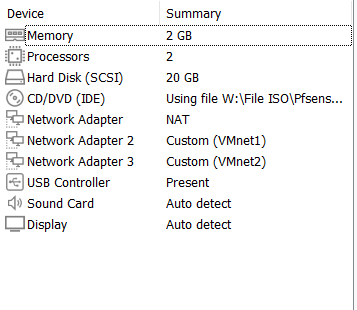
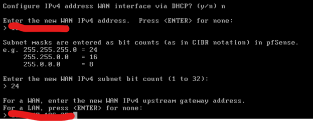

<<<<<<< HEAD
# 📘 Hướng dẫn cài đặt và cấu hình pfSense (Lab cơ bản)

## 1. Mục đích
Tài liệu này hướng dẫn:
- Cài đặt pfSense trên VMware
- Cấu hình WAN/LAN
- Truy cập và thiết lập ban đầu

---

## 2. Môi trường
- pfSense Community Edition
- VMware

---

## 3. Sơ đồ lab

---

## 4. Cấu hình Virtual Network

### 4.1 Host-Only
- Tạo mạng Host-Only
- Dùng cho LAN

### 4.2 DHCP
- Disable DHCP trên VMware (Host-Only)

---

## 5. Cấu hình pfSense VM

| Adapter | Chức năng |
|--------|----------|
| Adapter 1 | WAN |
| Adapter 2 | LAN |

---

## 6. Cấu hình CLI

### WAN
Option 2 → chọn 1 (WAN)

### LAN
Option 2 → chọn 2 (LAN)

Thông số:
- IP: 192.168.48.1
- Subnet: 24
- Gateway: để trống
- IPv6: để trống
- DHCP: bật

---

## 7. Truy cập GUI
- URL: https://192.168.48.1
- Username: admin
- Password: pfsense

---

## 8. Setup Wizard

- Step 1–2: Next
- Step 3: Asia/Ho_Chi_Minh
- Step 4: DHCP
- Step 5: 192.168.48.1/24
- Step 6: đổi pass (tuỳ chọn)

---

## 9. Kết quả
- pfSense hoạt động
- LAN: 192.168.48.0/24
- DHCP OK
- Truy cập GUI OK
  
---

## ! Lưu ý
- Không bật DHCP trên VMware
- Gán đúng adapter WAN/LAN
- Kiểm tra kết nối

---
=======
# Pfsense-basic-settup
>>>>>>> 7f9a88747e849f38d2648faffb21bcdec9de4733
