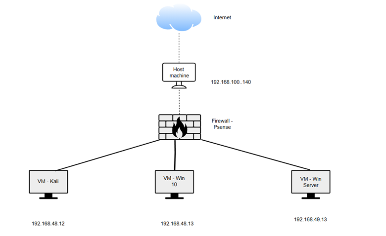

# pfSense Basic Setup Lab

## Giới thiệu

Đây là repository tài liệu thực hành các cấu hình cơ bản trên **pfSense** trong môi trường máy ảo.

Mục đích của repo này:
- Ghi lại quá trình học và thực hành pfSense
- Làm tài liệu tham khảo khi cấu hình firewall
- Hệ thống lại các bài lab theo từng chủ đề

## Nội dung hiện có

- **Lab 01**: Cài đặt môi trường pfSense trên VMware
- **Lab 02**: Cấu hình cơ bản (Firewall Rule)
- **Lab 03**: NAT Port Forward
- **Lab 04**: Giới hạn băng thông
- **Lab 05**: Chặn web
- **Lab 06**: THiết lập Rules phân quyên (*Coming soon*)

## Ghi chú

Tài liệu được viết ngẫu hứng bởi Otuslettia :)))) - rảnh thì viết

---
!dự kiến sau bài sẽ là pentest web 
